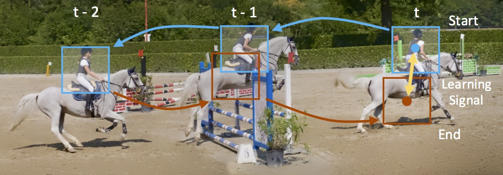
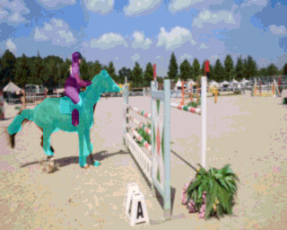
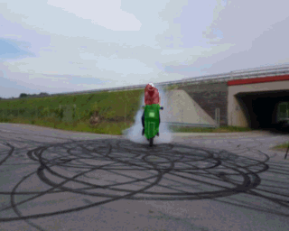

# TimeCycle

Code for [Learning Correspondence from the Cycle-consistency of Time (CVPR 2019, Oral)](https://arxiv.org/abs/1903.07593). The code is developed based on the [PyTorch](https://pytorch.org/) framework, in version PyTorch 0.4 with Python 2. It also runs smoothly with PyTorch 1.0. This repo includes the training code for learning semi-dense correspondence from unlabeled videos, and testing code for applying this correspondence on segmentation mask tracking in videos.

<div align="center">
  
</div>


## Citation
If you use our code in your research or wish to refer to the baseline results, please use the following BibTeX entry.
```
@inproceedings{CVPR2019_CycleTime,
    Author = {Xiaolong Wang and Allan Jabri and Alexei A. Efros},
    Title = {Learning Correspondence from the Cycle-Consistency of Time},
    Booktitle = {CVPR},
    Year = {2019},
}
```

## Model and Result
<p float="left">
  
  
  
</p>

Our trained model can be downloaded from [here](https://drive.google.com/file/d/1jKwP6qOoEFhhr9WFL_mfXvk0IHtElsmB/view?usp=sharing). The tracking performance on DAVIS-2017 for this model (without training on DAVIS-2017) is:

| cropSize | J_mean | J_recall | J_decay | F_mean | F_recall | F_decay |
| ------------- | ------------- | ------------- | ------------- | ------------- | ------------- | ------------- |
| 320 x 320 | 0.419 | 0.409 | 0.272 | 0.394 | 0.336 | 0.328 |
| 400 x 400 | 0.430 | 0.437 | 0.296 | 0.426 | 0.413 | 0.356 |
| 480 x 480 | 0.464 | 0.500 | 0.332 | 0.500 | 0.480 | 0.379 |

Note that one can easily improve the results in test time by increasing the input image size "cropSize" in the script. The training and testing procedures for this model are described as follows.

## Converting Our Model to Standard Pytorch ResNet-50

Please see [`convert_model.ipynb`](convert_model.ipynb) for converting our model [here](https://drive.google.com/file/d/1jKwP6qOoEFhhr9WFL_mfXvk0IHtElsmB/view?usp=sharing) to standard Pytorch ResNet-50 model format.


## Dataset Preparation

Please read [`DATASET.md`](DATASET.md) for downloading and preparing the VLOG dataset for training and DAVIS dataset for testing.

## Training
Replace the input list in train_video_cycle_simple.py in the home folder as:
```Shell
    params['filelist'] = 'YOUR_DATASET_FOLDER/vlog_frames_12fps.txt'
```
Then run the following code:
```Shell
    python train_video_cycle_simple.py --checkpoint pytorch_checkpoints/release_model_simple
```

## Testing
Replace the input list in test_davis.py in the home folder as:
```Shell
    params['filelist'] = 'YOUR_DATASET_FOLDER/davis/DAVIS/vallist.txt'
```
Set up the dataset path YOUR_DATASET_FOLDER in run_test.sh . Then run the testing and evaluation code together:
```Shell
    sh run_test.sh
```


## Acknowledgements

[weakalign](https://github.com/ignacio-rocco/weakalign) by Ignacio Rocco, Relja Arandjelović and Josef Sivic.

[inflated_convnets_pytorch](https://github.com/hassony2/inflated_convnets_pytorch) by Yana Hasson.

[pytorch-classification](https://github.com/bearpaw/pytorch-classification) by Wei Yang.
